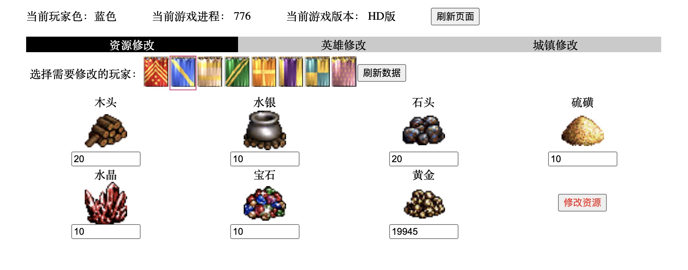

# 英雄修改3修改器

## 使用方法
1. 首先安装 python3 运行环境( https://python.org/ )(经过测试 python3.4，windows xp/10 可以使用。)
2. 执行命令 python app.py 启动修改器
3. 使用浏览器打开页面 http://127.0.0.1:9090 访问修改器界面

目前已实现的功能：
1. 玩家各项资源的修改；
2. 英雄的基本属性、兵种数量、各项技能、携带物品等的修改；

目前经过测试可支持《死亡阴影》的普通版本和HD版本的修改。游戏下载地址： https://pan.baidu.com/s/1z59TD_T1faujrbyLL-kiDQ 

